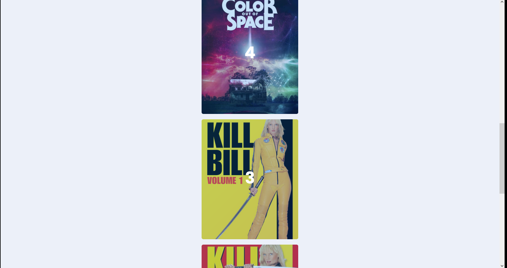
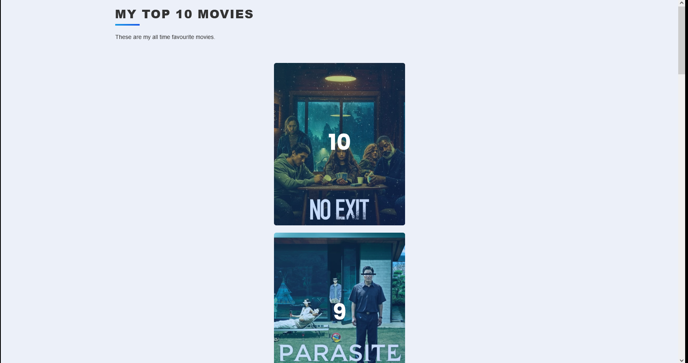
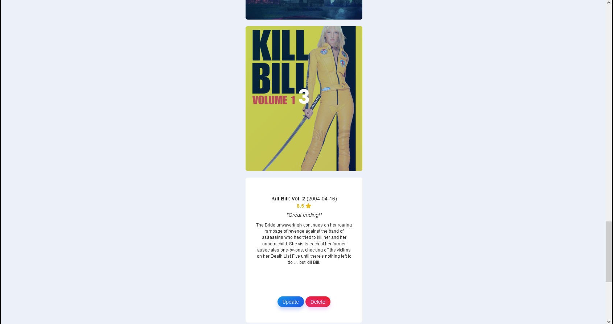

# my_TOP_movies_site
 
A really minimalist website I made to learn about SQL databases.
You can add movies (using the MovieDB API) give them ratings and a short review.

The cards are ordered according to your ratings.

And you can change your ratings or reviews if you're not satisfied with the ranking.

This project was part of the App Brewery course.